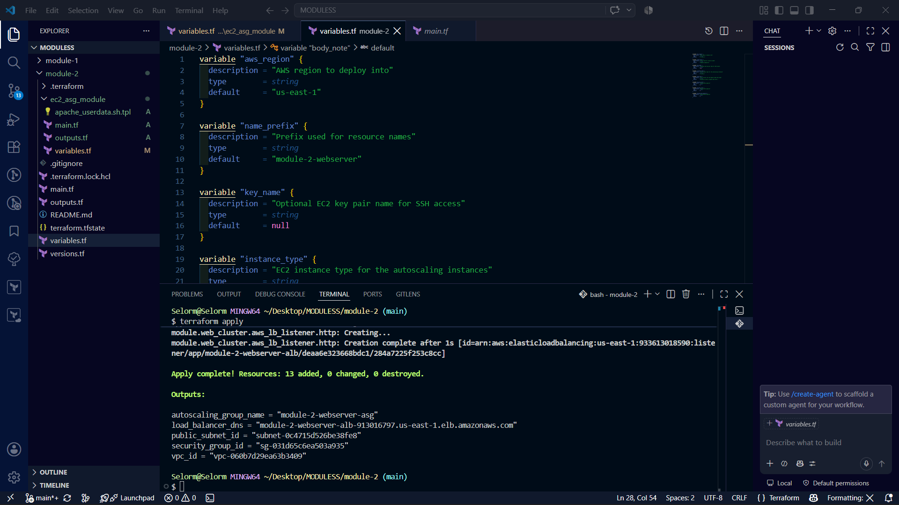
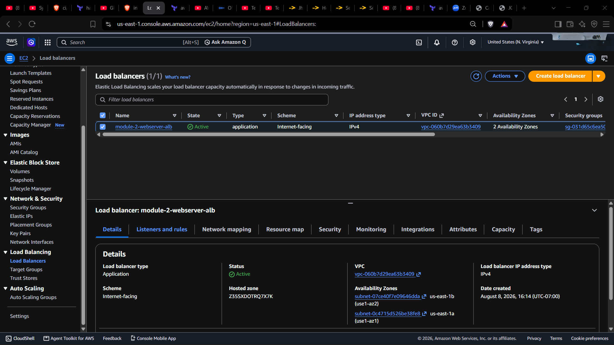
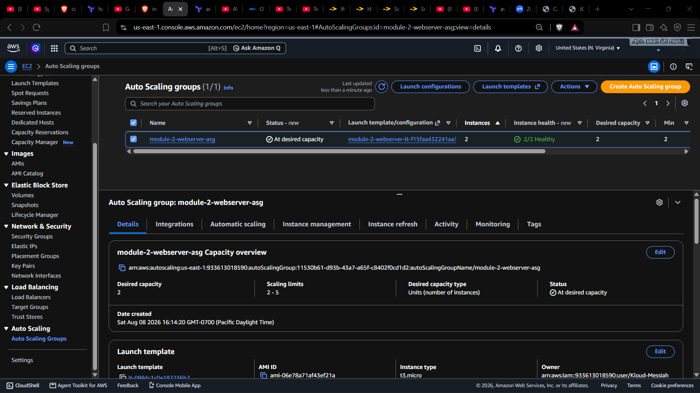
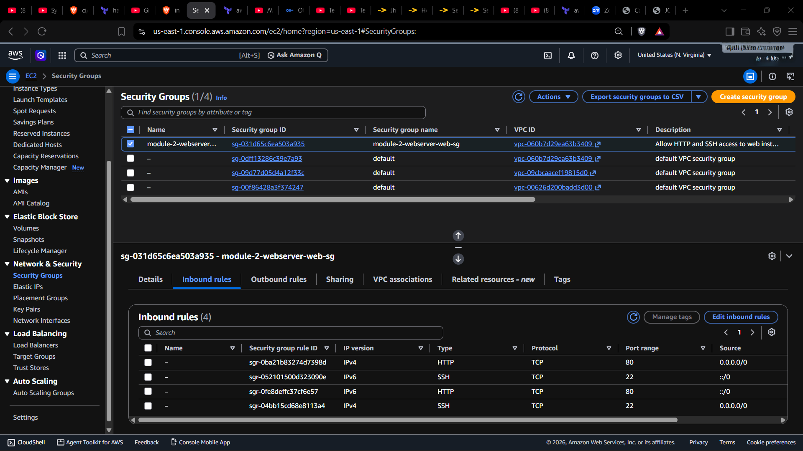
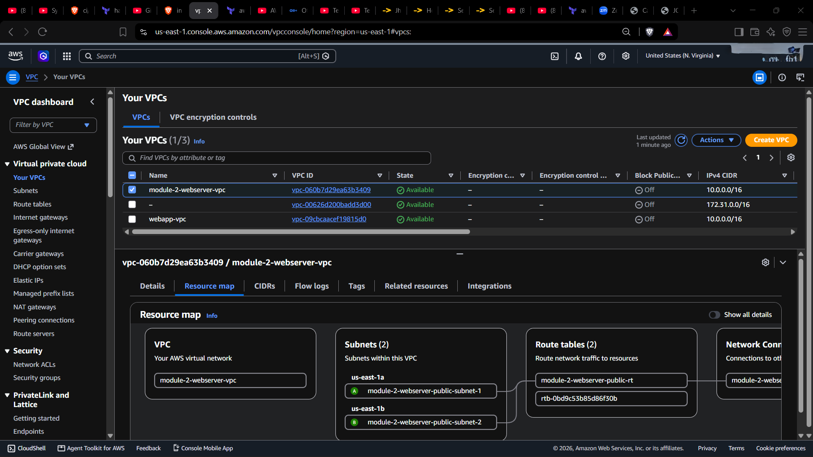

# Module 2: AWS Apache Web Cluster with Auto Scaling and ALB

This Terraform module deploys a complete AWS web server cluster using an Application Load Balancer, Auto Scaling Group, and Apache web servers running on Ubuntu. The root module in `module-2` uses a local child module at `ec2_asg_module` to create the networking and compute infrastructure.

## Architecture Overview

The module provisions the following resources:

- VPC with two public subnets in separate Availability Zones
- Internet Gateway and public route tables
- Security Group allowing inbound HTTP (80) and SSH (22)
- Application Load Balancer (ALB)
- Target Group and HTTP listener for the ALB
- EC2 Launch Template using Ubuntu 22.04
- Auto Scaling Group attached to the ALB target group
- Apache web server installed and configured on each EC2 instance via user data

## Root Module (`module-2`)

The root module contains:

- `main.tf`
- `variables.tf`
- `outputs.tf`
- `versions.tf`
- `terraform.tfstate` (state file for the deployed infrastructure)

The root module is primarily a wrapper that passes variables into the local child module `./ec2_asg_module`.

### Root Module Variables

- `aws_region`: AWS region to deploy into. Default: `us-east-1`
- `name_prefix`: Prefix for resource names. Default: `module-2-webserver`
- `key_name`: Optional EC2 key pair name for SSH access. Default: `null`
- `instance_type`: EC2 instance type for the auto scaling instances. Default: `t3.micro`
- `body_note`: Text written into the Apache `index.html` body. Default: `Welcome to Harry's Apache web server.`
- `asg_min_size`: Minimum Auto Scaling Group capacity. Default: `2`
- `asg_max_size`: Maximum Auto Scaling Group capacity. Default: `5`
- `asg_desired_capacity`: Desired Auto Scaling Group size. Default: `2`

### Root Module Outputs

- `vpc_id`: ID of the created VPC
- `public_subnet_id`: ID of the first public subnet
- `security_group_id`: ID of the web security group
- `load_balancer_dns`: DNS name of the Application Load Balancer
- `autoscaling_group_name`: Name of the Auto Scaling Group

## Child Module (`ec2_asg_module`)

The `ec2_asg_module` creates the actual AWS infrastructure for the web cluster.

Files in this module:

- `main.tf`
- `variables.tf`
- `outputs.tf`
- `apache_userdata.sh.tpl`

### Child Module Variables

- `aws_region`: AWS region to provision resources in. Default: `us-east-1`
- `name_prefix`: Prefix for resource names. Default: `module-2-webserver`
- `vpc_cidr`: CIDR block for the VPC. Default: `10.0.0.0/16`
- `public_subnet_cidr`: CIDR block for the first public subnet. Default: `10.0.1.0/24`
- `public_subnet_az`: Availability zone for the first public subnet. Default: `us-east-1a`
- `public_subnet_cidr_2`: CIDR block for the second public subnet. Default: `10.0.2.0/24`
- `public_subnet_az_2`: Availability zone for the second public subnet. Default: `us-east-1b`
- `instance_type`: EC2 instance type. Default: `t3.micro`
- `key_name`: Optional EC2 key pair name for SSH access. Default: `null`
- `asg_min_size`: Minimum number of Auto Scaling instances. Default: `2`
- `asg_max_size`: Maximum number of Auto Scaling instances. Default: `5`
- `asg_desired_capacity`: Desired Auto Scaling Group capacity. Default: `2`
- `body_note`: Content written into the Apache homepage on launch. Default: `Welcome to Harry's Apache web server.`

### Child Module Outputs

- `vpc_id`: ID of the created VPC
- `public_subnet_id`: ID of the first public subnet
- `security_group_id`: ID of the web security group
- `load_balancer_dns_name`: DNS name of the ALB
- `autoscaling_group_name`: Name of the Auto Scaling Group

## Apache User Data

The child module uses `apache_userdata.sh.tpl` to bootstrap each instance:

- Installs Apache HTTP Server
- Writes a simple HTML page to `/var/www/html/index.html`
- Starts and enables Apache

The HTML page includes the `body_note` variable text.

## Deployment Instructions

1. Initialize Terraform:

```bash
terraform init
```

   2.Review the plan:

```bash
terraform plan
```

3.Apply the configuration:

```bash
terraform apply
```

1. After apply completes, access the website via the ALB DNS name from the output.

## Example Usage

Customize deployment by creating a `terraform.tfvars` file or passing values at the command line.

Example `terraform.tfvars`:

```hcl
aws_region = "us-east-1"
name_prefix = "custom-webcluster"
key_name = "my-keypair"
instance_type = "t3.small"
asg_min_size = 2
asg_max_size = 4
asg_desired_capacity = 2
body_note = "Hello from Terraform Auto Scaling Web Cluster!"
```

## Screenshots

Supported images are available in this module folder. Use them for visual reference when inspecting the deployment and outputs.

- 
- 
- 
- 
- 

## Notes

- The module uses the latest Ubuntu AMI published by Canonical for `ubuntu-jammy-22.04`.
- Instances are created with public IP addresses and are reachable through the ALB.
- SSH access is allowed on port 22 if `key_name` is provided and the security group ingress is permitted.
- The ALB listens on HTTP port 80 and forwards traffic to the auto scaled EC2 instances.
- Ensure your AWS credentials and permissions allow creation of VPCs, EC2 instances, ALBs, and Auto Scaling resources.

## Cleanup

Remove the infrastructure when finished:

```bash
terraform destroy
```
